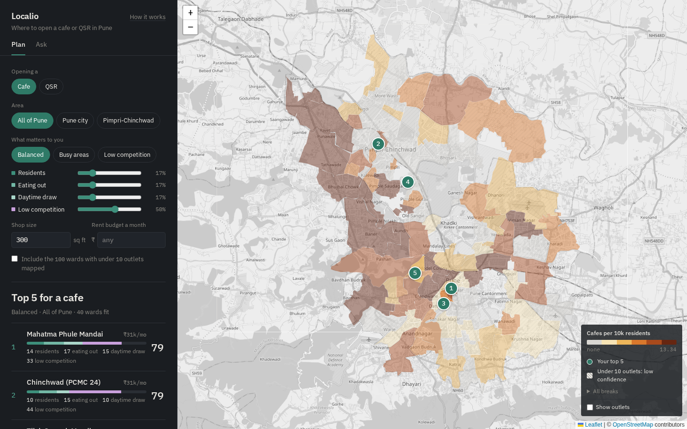
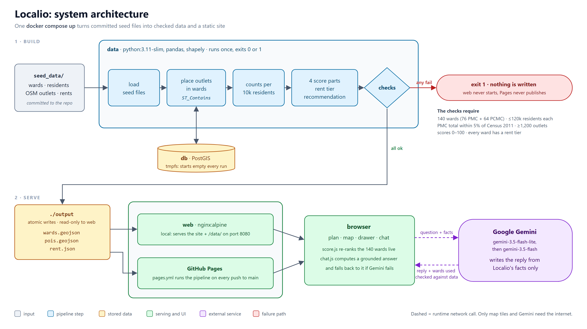

# Localio

**Shortlist where to open a cafe or a QSR in Pune.**

Picking a neighbourhood comes before picking a shop, and it's usually done on gut feel. Localio makes that first cut with data. Describe what you're opening, who your customers are and what rent you can pay. It ranks all 140 of Pune's wards, estimates the rent in each, and shows exactly why each ward scores what it does. You end up with a short list of areas worth visiting.

**Try it:** https://33avash.github.io/Localio/



## Who it's for

Anyone doing a first-cut site search for a small food business in Pune, such as a founder planning a first cafe or a chain looking at its next outlet. It answers "where should I look?", not "will this shop make money?".

## A walkthrough

Say you're opening a **300 sq ft coffee bar for students and office workers**, you'd rather not sit next to other cafes, and you can pay **₹35,000 a month** in rent.

1. **Answer the four questions:** Cafe · Office workers and students · Avoid competition · All of Pune, 300 sq ft, ₹35,000.
2. **Read the shortlist.** Katraj Dairy comes first (79/100): 4 colleges, 8 stations and only 2 cafes mapped, at about ₹31k a month. Pune University (77) and Janwadi-Gokhalenagar (76) would make the top 5 but drop out on rent (₹49k and ₹69k). The map turns green where a ward fits and grey where your brief rules it out.
3. **Compare** the top 3 side by side: score, each part of it, rent, the sales you'd need, residents, competition.
4. **Ask** in plain words: *"Why is Katraj Dairy first?"*, *"Compare Baner and Aundh"*, *"Rent there for 400 sq ft?"*. Answers come from the same data, and every ward they name opens on the map.
5. **Share** the link. It holds the whole brief (`#cafe?for=offices&competition=avoid&budget=35000`), so it opens the same shortlist anywhere.

Then go and visit. See [the limits](#limits) for why.

## How a ward is scored

Four parts, each from 0 to 1:

| Part | Asks | Measured as |
|---|---|---|
| **Residents** | Do many people live here? | the ward's standing among the 140 on residents per km² (0.8 = higher than 80% of wards) |
| **Eating out** | Do people already go out to eat here? | its standing on food and drink places per km² |
| **Daytime draw** | Does anything bring people in by day? | its standing on offices, colleges and stations per km² |
| **Low competition** | How crowded is your format already? | `1 − x / (x + r)`: x is your format's outlets per 10,000 residents (plus one, since OpenStreetMap misses outlets), r the rate in the 40 well-mapped wards (2.49 cafes, 2.34 QSRs). 0.5 at that rate. |

```
score = 100 × Σ(weight × part) / Σ(weights)
```

Your answers set the weights:

| Who are your customers? | Residents | Eating out | Daytime draw |
|---|---|---|---|
| A mix of everyone | 1 | 1 | 1 |
| People who live nearby | 3 | 0 | 0 |
| Office workers and students | 0 | 0 | 3 |
| People out to eat | 0 | 3 | 0 |

| How much competition can you take? | Low competition |
|---|---|
| Avoid it | 5 |
| Some is fine | 3 |
| Don't mind | 1 |

With "some is fine", the people side and the competition side count half each. Every weight can be fine-tuned (0–5) with sliders. Each row on the site shows the points from each part, and they add up to the score.

**Rent** = typical Pune shop rent (₹137.5 per sq ft a month, the median of 25 listings) × the ward's tier (0.6× to 1.68×, from Cushman & Wakefield's high-street rents) × your shop size. Localio also shows the monthly sales that would keep rent at a healthy 8–15%.

Wards with fewer than 10 outlets mapped are scored but left off the shortlist unless you include them: that few usually means thin mapping, not an empty market.

## Limits

The site states these under every shortlist, too.

- **Visit first.** The score compares wards from data. It can't see the street, the shop or the footfall at your hours.
- **Outlets are undercounted.** They come from OpenStreetMap, which misses places, most of all in Pimpri-Chinchwad. "No cafes" can mean "none mapped yet".
- **Residents are 2011 figures** on 2012 wards. Newer areas at the city's edge have grown since.
- **Rent is an estimate**, not a quote. Tiers come from ten published streets; other wards are estimated from their zone.
- **No sales forecast.** There's no open data to predict what a shop will earn, so Localio doesn't try.
- **The chat can misread a question.** Its facts come from the data, but check any ward it names by opening it.

## Run it yourself

You need Docker with Compose v2.

```
git clone https://github.com/33avash/Localio.git
cd Localio
docker compose up --build
```

Open **http://localhost:8080** once the `data` container has finished (about a minute the first time). Stop it with `docker compose down`.

No keys are needed. Two are optional, set in a `.env` copied from `.env.example`:

- `GEMINI_API_KEY`: a free [Google AI Studio](https://aistudio.google.com/apikey) key. With it, the chat's replies are worded by an AI model (Gemini) from Localio's facts; without it, the chat gives its own rule-based answers.
- `LOCALIO_CARTO_KEY` gives a quieter basemap. `LOCALIO_PORT` changes the port if 8080 is taken.

## How it's built



- **db** is a throwaway PostGIS database. The pipeline uses it to place every outlet in its ward by boundary (`ST_Contains`).
- **data** reads `seed_data/`, scores every ward, runs its checks, and writes `wards.geojson`, `pois.geojson` and `rent.json`. If any check fails, it writes nothing and the site doesn't start.
- **web** is nginx serving the site (Leaflet and plain JavaScript modules, no build step) and the pipeline's output. Scoring, ranking and comparing happen in the browser, from the same numbers the pipeline wrote.

**The chat** is grounded in the data. Localio's own engine reads the question (the wards it names, the format, area, budget, size, customers) and works out the answer from the ward data. The AI model then only words the reply from those facts. The wards it names are checked against the data, it declines anything off-topic, and if it fails, the engine's own answer is shown. The key is readable in the published page, so restrict it to the site's address in Google Cloud (see [docs/ARCHITECTURE.md](docs/ARCHITECTURE.md#the-chat)).

GitHub Actions runs every test on each pull request, and on each push to `main` runs the same pipeline container to publish the site to GitHub Pages.

### Repository layout

```
data/          the pipeline (Python) and its unit tests
web/           the site: HTML, CSS, JavaScript modules, served by nginx
tests/e2e/     browser tests (Playwright)
seed_data/     every input, committed, so a build never needs the network
tools/geo/     one-off tools that rebuild seed_data/ from the internet
scripts/       verify.sh: a clean start through every test
docs/          architecture, design decisions, licences, the manual QA list
```

## Check it works

```
make verify        # or: bash scripts/verify.sh
```

It tears everything down, rebuilds, runs the pipeline's checks, its 34 unit tests and 45 browser tests, and prints a summary:

```
localio verify
  ok    clean start
  ok    build, pipeline, health checks
  ok    pipeline checks
  ok    pipeline unit tests
  ok    browser tests: map, chat, visuals
all checks passed
```

## Data

| Data | Source | Licence |
|---|---|---|
| 140 ward boundaries (2012) | [DataMeet](https://github.com/datameet/Pune_wards) | CC BY-SA 2.5 IN |
| Residents per ward | Census 2011 totals, shared by 2012 voter rolls (PMC) or equally (PCMC) | Government Open Data Licence |
| 1,702 food and drink outlets; offices, colleges, stations | [OpenStreetMap](https://www.openstreetmap.org), via Overpass | ODbL |
| High-street rents | [Cushman & Wakefield](https://www.cushmanwakefield.com/en/india/insights/pune-marketbeat), Q2 2026 | cited figures |
| Shop listings | [Square Yards](https://www.squareyards.com/rent/shops-for-rent-in-pune), 25 listings | cited figures |

[docs/DATA_LICENSES.md](docs/DATA_LICENSES.md) lists every source and tool with its terms. The code is MIT licensed.

## More

- [docs/ARCHITECTURE.md](docs/ARCHITECTURE.md): the containers, the pipeline's checks, the chat, publishing
- [docs/DECISIONS.md](docs/DECISIONS.md): the main design choices and why
- [docs/QA.md](docs/QA.md): what to check by hand before a demo
- [seed_data/SOURCES.md](seed_data/SOURCES.md): every input and how to refresh it
