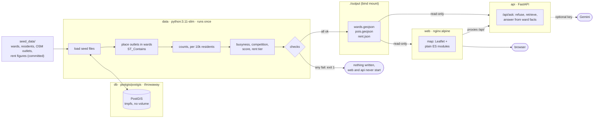

# Architecture

One `docker compose up` goes from committed seed files to a working site. The pipeline runs once and exits; the map and the chat then serve what it wrote.

## Containers

| Service | Image | Runs | Job |
|---|---|---|---|
| `db` | `postgis/postgis:17-3.5` | while the stack is up | Spatial joins for the pipeline. Its data lives in tmpfs, so every run starts empty. |
| `data` | `python:3.11-slim` + pandas, shapely, psycopg | once; exits 0 or 1 | Load, join, score, check, write `./output`. |
| `web` | `nginx:alpine` | long-running, port 8080 | Serve the site, serve `./output` at `/data/`, proxy `/api/`. |
| `api` | `python:3.11-slim` + FastAPI, fastembed | long-running | Answer chat questions from the ward facts. |
| `e2e` | `mcr.microsoft.com/playwright` | on demand (`test` profile) | Browser tests against `web`. |
| `osm`, `population` | `python:3.11-slim` + requests, rasterio | on demand (`tools` profile) | Rebuild `seed_data/` from the internet. |

## How the pieces connect

- **Start order.** `data` waits for `db` to be healthy. `web` and `api` wait for `data` to finish successfully, so a failed check means the site never shows bad numbers.
- **No stale state.** The database uses tmpfs and `./output` is a bind mount, not a named volume. nginx serves `/data/` with `Cache-Control: no-store`. Every run shows that run's numbers.
- **Atomic writes.** The pipeline writes each file to a `.tmp` sibling, then renames it, so nginx never serves half a file.
- **The chat can't take the map down.** nginx looks up `api` per request, so the map loads even if `api` is down; the chat then says it isn't reachable.
- **Offline by default.** Seed data, Leaflet and the fonts are committed. The only runtime network use is map tiles, and the map still works without them.

## What the pipeline checks

The pipeline refuses to write anything if:
- the ward count isn't 76 PMC + 64 PCMC,
- any ward has more than 120,000 residents,
- the PMC total isn't within 5% of the Census 2011 figure (3,124,458),
- there are fewer than 1,200 outlets or 200 cafes, or outlets per 10,000 residents fall outside 2–40,
- any score is outside 0–100,
- any recommendation still has an unfilled `{slot}`,
- any ward has no rent tier.
