# Architecture

Localio is a small multi-container pipeline. One container turns a seed table into scored GeoJSON and exits. A second serves that GeoJSON and a static map. Compose wires them together so a single `docker compose up` goes from raw CSV to a working site.

## Today

```mermaid
flowchart LR
    subgraph seed["seed_data/ (committed)"]
        csv["pune_cafes_qsr.csv<br/>260 cafes and QSRs"]
        geo["catchments.geojson<br/>51 polygons + population"]
    end

    subgraph data["data container · python:3.11-slim · runs once"]
        direction TB
        load["load + clean<br/>drop unplaceable rows"] --> agg["aggregate by locality"]
        agg --> join["join catchments<br/>population, area, label point"]
        join --> density["outlets per 10k residents<br/>quantile classes"]
        density --> score["opportunity score<br/>demand, supply, weakness"]
        score --> check{"validate<br/>known totals and top 3"}
    end

    subgraph out["./output (bind mount)"]
        pois["pois.geojson"]
        locs["localities.geojson"]
    end

    subgraph web["web container · nginx:alpine · long-running"]
        static["static site<br/>Leaflet, vanilla ES modules"]
        cfg["/config.json<br/>optional CARTO key"]
    end

    subgraph api["api container · FastAPI · long-running"]
        ask["/api/ask<br/>refuse, retrieve (fastembed),<br/>answer (Gemini or templates)"]
    end

    csv --> load
    geo --> join
    check -- "all ok" --> pois & locs
    check -- "any fail: exit 1, write nothing" --> stop(["web never starts"])
    pois & locs -- "read-only mount, served at /data/" --> web
    locs -- "read-only mount" --> api
    web -- "proxies /api/" --> api
    api -. "optional, with a key" .-> gemini(["Gemini Flash"])
    web --> browser(["browser: map, drawer, chat"])
    tiles(["basemap tiles<br/>OSM, or CARTO with a key"]) -.-> browser

    tool["catchments tool<br/>profile: tools, needs network"] -. "rebuilds when localities change" .-> geo
```

### Containers

| Service | Image | Lifetime | Role |
|---|---|---|---|
| `data` | `python:3.11-slim` + pandas, openpyxl | runs once, exits 0 or 1 | Load, clean, aggregate, score, validate, write GeoJSON |
| `web` | `nginx:alpine` | long-running, port `${LOCALIO_PORT:-8080}` | Serve `web/static/`, serve `./output` at `/data/`, serve `/config.json`, proxy `/api/` |
| `api` | `python:3.11-slim` + FastAPI, fastembed (model baked in) | long-running, healthcheck on `/api/health` | Answer chat questions from the locality facts |
| `catchments` | `python:3.11-slim` + rasterio, shapely, pyproj | on demand, `tools` profile | Rebuild `seed_data/catchments.geojson` from HRSL population; needs network |

### How the pieces connect

- **Start order.** `web` has `depends_on: data: condition: service_completed_successfully`. If any validation check fails, `data` exits 1, writes nothing, and `web` never starts, so the site can't show numbers from a broken run.
- **Shared output is a bind mount.** `./output` is mounted into both containers, read-write for `data` and read-only for `web`. A named volume would keep the last run's files and the map could quietly show stale numbers. For the same reason nginx sends `/data/` with `Cache-Control: no-store`.
- **Writes are atomic.** The pipeline writes each file to a `.tmp` sibling, sets it to 0644, then renames it, so nginx never serves a half-written file.
- **Config without a rebuild.** nginx's entrypoint runs `envsubst` on its config template at startup, so `LOCALIO_CARTO_KEY` from `.env` reaches the page at `/config.json` without baking a key into an image.
- **The chat can't take the map down.** nginx resolves `api` per request through Docker's DNS rather than at startup, so `web` starts and serves the map even if `api` is missing. The chat then shows "isn't reachable" within about 2 seconds.
- **Offline by default.** Leaflet and the fonts are vendored, and the population data is precomputed and committed. The only runtime network use is basemap tiles, and the map works without them.

## Where the machine learning runs

- **In `data`, once per build:** the footfall model (ridge regression, validated on held-out localities, gated against a baseline) and the market types (k-means). Their output ships in `localities.geojson`, and their evaluation in `model_report.json`.
- **In `api`, per question:** embedding retrieval with `bge-small-en-v1.5` and the refusal check. Gemini Flash, if a key is set, only rewrites retrieved facts into sentences.

## Still to come

- **One command to verify it all.** `make verify` rebuilds from scratch and runs the pipeline checks, both pytest suites, the chat evaluation and Playwright end-to-end tests. GitHub Actions already runs everything except Playwright on every pull request.
